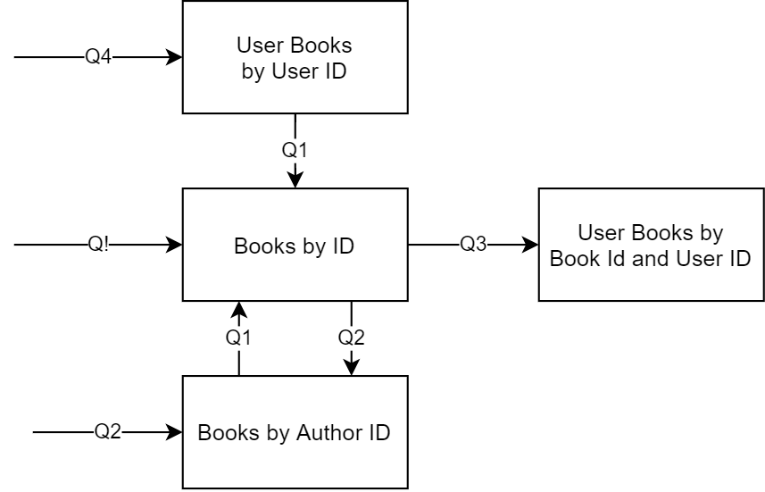

# BetterReads web app
Companion code for the Java Brains code with me series.

# Non-functional Requirement
1. Fast and Performant
2. Handle large amount of data ( i.e. all books ever published in the world)
3. Reliable and Scaleable 
4. Back-end focused
5. Spring Boot & Spring MVC, Spring Security, NoSQL (Apache Cassandra, a distributed DB, multiple nodes and cluster keep sync), Spring Data Cassandra 
6. Searching books (for searching in Cassandra, a separate system needs for that, like, Apache Solr, Apache Lucene installation, some kind of Search Implementation that built on that DB for making search index). 
For seaching that adds a lot more complexity. So, let's depend on Open Library API for that.
7. Pre-Load the Large data set from Open Library Website (Load data on a scheduled manner to keep up-to-date the DB with latest data)
8. Stateless application so that multiple instance can run

# Steps:

* ER Diagram

* Data Modeling (Notes: Cassandra advanced data modeling. RDMS have their data modeling methodology and diagrams. What about Cassandra? Let's discover the key principles of Cassandra data modeling with the Chebotko methodology. Have a look at KDM, a Chebotko modeling tool. And finally, let's talk about the time dimension in Cassandra)
* Query Model

* Chebotko Diagram 

* A partion key (K) is required to determine which node/cluster/bucket/partion the data would go (as Cassandra is multi-cluster, distributed DB, Date is distributed amoung the Nodes, might replicate the data on each node if you want that). Each partion may contain one or more records (similar like, one2one or one2many). Depends on the defination of partition key. (note: To-do: Study how cassandra manages these partitions, Cassandra essential course java brain 😊)

* Is there any possibilites too much data on a single node ?
* Note: One record per pertition, no worry. But, multiple records in one node, that is the concern. Need to careful about the partion data size. If many data, an extra partitioning column can be added to divide the data in multiple partiotion. But, defining an extra column can degrade proformance also (i.e. which partion contains less data, extra partioning column will result unecessary data division in multiple nodes/partions)
* For ordering or sorted data, we need to define a Clustering cloumn as runtime ordering not supported.
* In NoSQL designing, you don't look to the Data model rather look into the Query or System flow.

# Prerequisites:
1. JDK and IDE installed on your machine
2. Register for a free hosted Cassandra instance: https://dtsx.io/2WQoLWk. You get a a DataStax Astra DB account with a generous free tier that you can use to follow along the code.
License: APL 2.0

# Technologies:
Application Tier: Spring Boot
Database: Apache Cassandra
Data Layer: Spring Data Cassandra
Security: Spring Security
View Layer: Thymeleaf